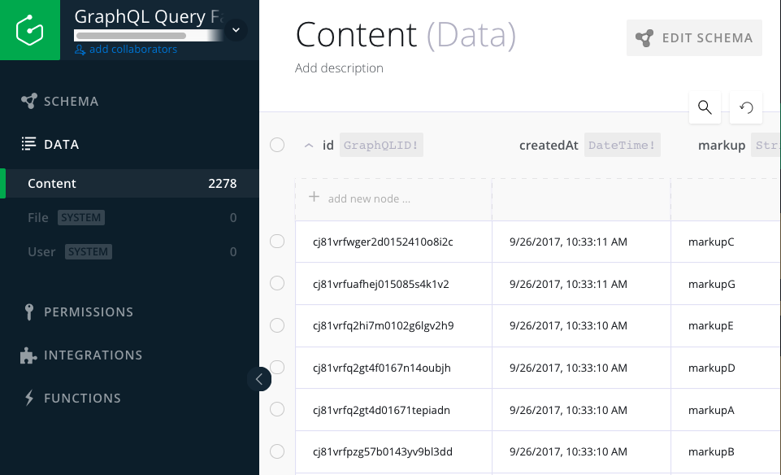

# GraphQL Query Batcher


## Status
* `factory` included as of 1.20.0 (shim around builder and batcher)
* `batcher` included as of 1.20.0 (executes array of queries)
* `builder` updated (this builds query strings from query/mutation and variables)

### Action Items
You can see TODOs and release plans in [todo.md](./docs/todo.md)

## Getting Started
### Installation
```bash
npm install graphql-query-factory -S
```

### Examples
> All of these examples can be seen at [graphql-query-factory-test](https://github.com/alechp/graphql-query-factory-test)

All mock variables (e.g. "mock.template", "mock.variables") can be viewed here: [.../tests/_mock.js](https://github.com/alechp/graphql-query-factory/blob/master/src/tests/_mock.js)

--------------------------------

#### builder
```js
const { builder } = require('graphql-query-factory');

let queries = builder(mock.template, mock.variables);
log(`builder(mock.template, mock.variables): ${queries}`);
```

> NOTE: async version has been replaced here with sync version.
> Will be adding async version of builder in future along with a stream. See [todo.md](./docs/todo.md) for details.

--------------------------------

#### factory
```js
const { factory } = require('graphql-query-factory');

factory(mock.template, mock.variables)
  .then(data =>
    log(
      `factory(mock.template, mock.variables): ${JSON.stringify(data, null, 4)}`
    )
  )
  .catch(err => log(`factory(mock.template, mock.variables): ${err}`));
```

--------------------------------

#### batcher
```js
const { batcher } = require('graphql-query-factory');

batcher
  .request(mock.singleQuery)
  .then(data => log(`batcher.request(mock.singleQuery): ${(data, null, 4)}`))
  .catch(err => log(`batcher.request(mock.singleQuery): ${err}`));
```
--------------------------------

#### Visual of data being saved to GraphQL database



##### Configuration (Environment Variables)

When using `factory` or `batcher` you must include two environment variables:
* `GQL_SIMPLE_ENDPOINT`
* `GQL_AUTH_TOKEN`

If you don't already have a method for this, you can:

1. Create `.env` file in your root directory
2. `npm install dotenv -S`
3. add `require('dotenv').config()` at entry point (i.e. index/main) of your project
4. define variables like so:
```
GQL_SIMPLE_ENDPOINT=http://api.endpoint.goes.here/12345
GQL_AUTH_TOKEN=longobscuretoken1290239809
```
^ note that there's no quotation marks
